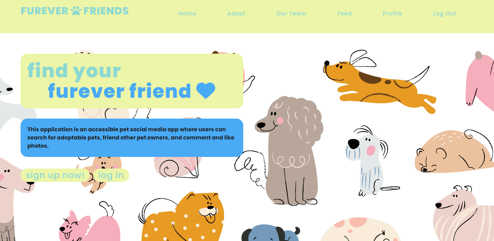

# Furever Friends

## Description

This application is an accessible pet social media app where users with a variety of abilities can share posts about their pets, view their profile, and have the option to adopt a new pet by searching for local dogs and/or cats by location.

## Table of Contents

- [Installation](#installation)
- [Technology](#technology)
- [User Story](#user-story)
- [Contact](#contact)
- [Links](#links)

## Installation

Our application was built using the MERN (MongoDB, Express.js, React.js, and Node.js) stack. In order to run application, either fork or run "NPM Install," "NPM Run Build," and "NPM Run Develop" in the command line.

## Technology

Our application was built using the MERN (MongoDB, Express.js, React.js, and Node.js) stack.

Front-End Technology
- React JS 
- Apollo Client
- PetFinder API

Back-End Technology
- Node.js & Express
- Apollo & GraphQL
- MongoDB & Mongoose
- JWT
- Bcrypt

## User-Story

AS A pet lover who wants to interact with others or become a pet owner, 

I WANT to be able to login or sign-up as a new user to an application,

SO THAT I can view adoptable pets by specific search criteria, such as zip code,

AND SO I can find my next furever friend,

AND I WANT to be able to post comments about my pet in order to share with other users,

SO THAT other users can view my comments on their profile

## Contact

Members of Furever Friends:

- Elaine Danahy - https://github.com/edanahy22
- Maia Davis - https://github.com/maiavelli
- Melissa Deven - https://github.com/Deven1991 
- Ethan Torres - https://github.com/ethantor12

## Links

- GitHub Repo: https://github.com/p3-elaine-melissa-maia/FureverFriends.git
- Deployed Heroku: https://furever-friends-09172022.herokuapp.com/

Preview of Deployed Application: 

   
